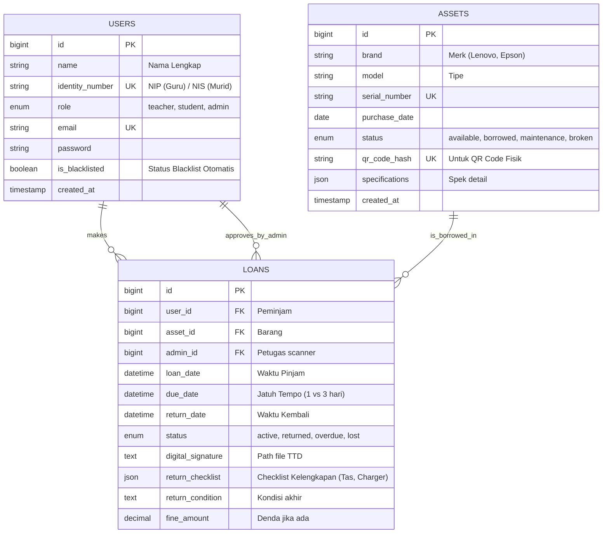

# Skema Database (ERD) - Sistem Inventaris Sekolah

Berikut adalah rancangan database relasional menggunakan notasi Mermaid. Diagram ini mencakup entitas utama: **Users** (Peminjam), **Assets** (Barang), dan **Loans** (Transaksi).



## Penjelasan Relasi & Logika
1.  **Users ↔ Loans (One-to-Many)**: Satu user bisa memiliki banyak riwayat peminjaman, tapi sistem logic (Blacklist) akan membatasi peminjaman *aktif* hanya satu (atau sesuai limit).
2.  **Assets ↔ Loans (One-to-Many)**: Satu barang akan memiliki banyak history peminjaman. Status barang saat ini ditentukan oleh transaksi terakhir (jika status=active, maka Asset=borrowed).
3.  **Role Based Logic**: Kolom `role` di tabel `USERS` menjadi penentu logika perhitungan `due_date` di Controller.

---

## Struktur Folder Project (Laravel)

```
/app
├── Http
│   ├── Controllers
│   │   ├── AuthController.php
│   │   ├── AssetController.php      (CRUD Barang & Log History)
│   │   ├── BorrowingController.php  (Core Transaction)
│   │   └── MonitorController.php    (Dashboard Realtime)
│   ├── Middleware
│   │   └── CheckBlacklist.php       (Middleware pencegah transaksi untuk user bermasalah)
│   └── Requests
│       └── StoreLoanRequest.php     (Validasi Input)
├── Models
│   ├── User.php
│   ├── Asset.php
│   └── Loan.php
├── Services
│   ├── LoanService.php              (Business Logic: Hitung tanggal, Cek stok)
│   └── QrCodeService.php            (Generate QR)
└── Notifications
    └── LoanDueReminder.php          (Email/WA Notification)
```
